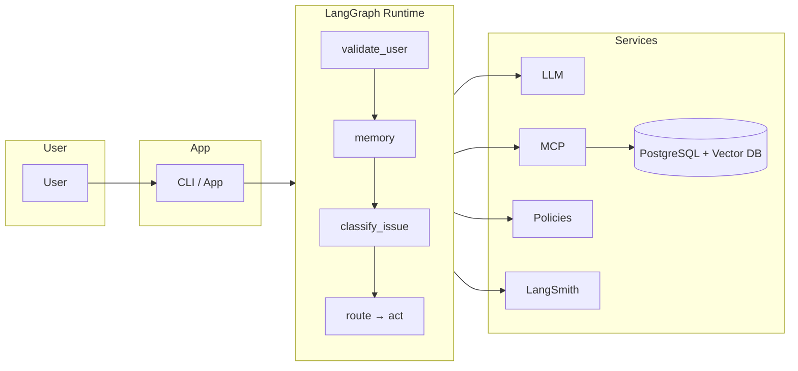
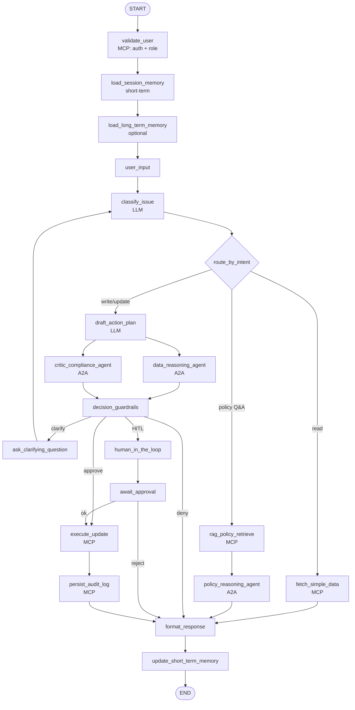
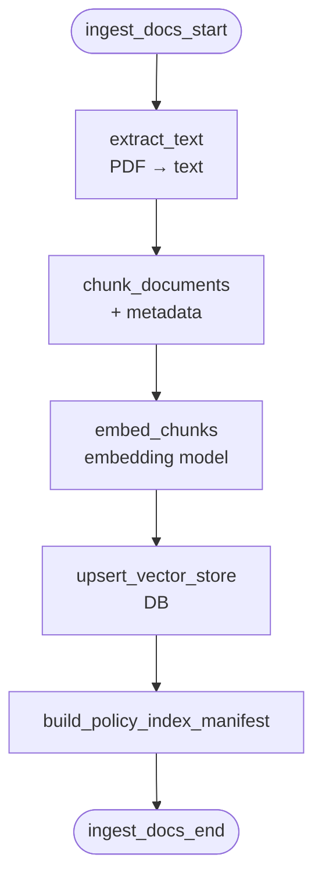

# AI-Powered HR Decision Assistant — Architecture Diagrams

Visual reference for the system.

| What | Where |
|------|--------|
| **This file** | Mermaid + ASCII diagrams; view in GitHub, VS Code (Mermaid preview), or [mermaid.live](https://mermaid.live). |
| **PNG images** | Run `python make_architecture_diagram.py` from the **architecture/** folder. Generates: `architecture_spec.png`, `architecture.png`, `hr_decision_graph.png`, `policy_ingestion_graph.png`. |

---

## 1. System overview (components)

```
┌─────────────┐     ┌─────────────┐     ┌──────────────────────────────────────────────────┐
│   User      │────▶│  CLI / App  │────▶│              LangGraph Runtime                    │
└─────────────┘     └─────────────┘     │  validate → memory → classify → route → act       │
                                        └────────────┬─────────────────┬───────────────────┘
                                                     │                 │
                    ┌────────────────────────────────┼─────────────────┼────────────────────┐
                    │                                │                 │                    │
                    ▼                                ▼                 ▼                    ▼
             ┌────────────┐                  ┌────────────┐    ┌────────────┐       ┌────────────┐
             │    LLM     │                  │    MCP     │    │  Policies  │       │ LangSmith  │
             │ (classify, │                  │ (auth, DB,│    │ (RAG /     │       │ (tracing)  │
             │  RAG,      │                  │  search,   │    │  vector    │       │            │
             │  format)   │                  │  audit)    │    │  store)    │       │            │
             └────────────┘                  └─────┬──────┘    └────────────┘       └────────────┘
                                                    │
                                                    ▼
                                             ┌────────────┐
                                             │ PostgreSQL │
                                             │ + Vector DB│
                                             └────────────┘
```

**Mermaid version (copy to mermaid.live):**



---

## 2. Online decision graph (runtime, per request)

High-level flow: **validate → memory → classify → route** into three branches, then **guardrails → execute → explain**.



---

## 3. Offline policy ingestion (batch)

Run when PDFs change. Feeds the vector store used by **rag_policy_retrieve** at runtime.



---

## 4. Branch summary (what runs when)

| Route        | When                         | Nodes in order |
|-------------|------------------------------|----------------|
| **Simple read** | "How many leaves?", "My laptop?" | fetch_simple_data → (optional policy_lookup) → format_response |
| **Policy Q&A**  | "What is bereavement leave?"     | rag_policy_retrieve → policy_reasoning_agent → format_response |
| **Write/update**| "Apply leave Friday"             | draft_action_plan → policy + data agents → critic → guardrails → (clarify / HITL / execute) → audit → format_response |

---

## 5. MCP tools (execution)

| Tool                | Purpose                          |
|---------------------|----------------------------------|
| auth / query_data   | Validate user, role, admin_rights |
| policy.semantic_search | RAG over policy embeddings     |
| db.read             | Read employees, attendance, timesheet, assets |
| db.validate         | Validate proposed action (no write) |
| db.execute          | Write after guardrails/approval  |
| approval.request    | HITL request to manager/HR      |
| audit.write         | Persist decision, why, policy_reference |

---

## 6. A2A agents (reasoning)

| Agent                  | Role |
|------------------------|------|
| Concierge / Orchestrator | User interaction, graph control |
| Policy Agent           | Interpret policy chunks → rules |
| Data Reasoning Agent   | Validate SQL/DB logic |
| Critic / Compliance   | Second-pass review |
| Sentiment (optional)   | Frustration → escalate |
| Prediction (optional)  | Leave/attendance risk, anomalies |

---

## 7. Explainability (every decision)

- **decision** — e.g. Leave Approved / Denied  
- **why** — human-readable bullets  
- **policy_reference** — e.g. Section 4.1 – Leave Rules  

Stored in state (`reasoning_output`) and in audit log.
